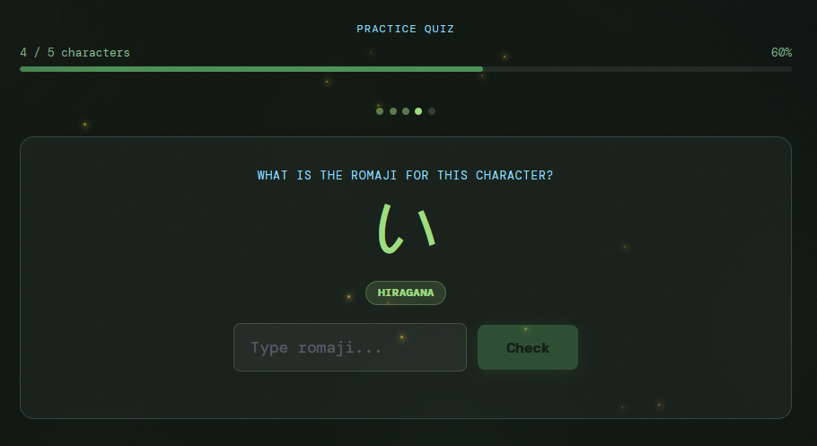
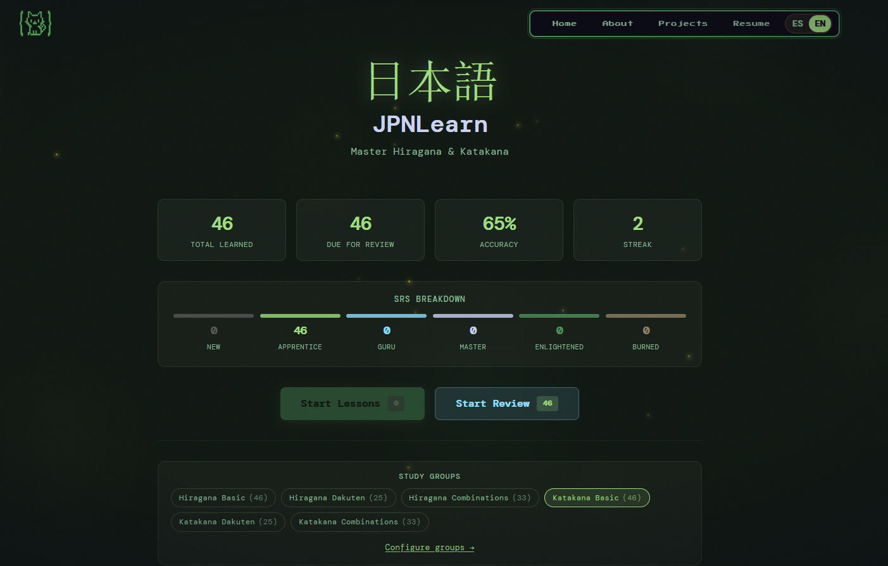

# JPNLearn

A gamified Hiragana & Katakana study component for React, inspired by WaniKani. Drop it into any React 18+ app and get a full spaced-repetition learning system out of the box.



## Features

- **Spaced Repetition System (SRS)** — 10-level WaniKani-style algorithm with intervals from 2 hours to ~4 months
- **Lesson mode** — Progressive 5-character batches with built-in quizzes
- **Review mode** — Practice characters due for review with streak tracking
- **246 characters** across 6 groups: Hiragana & Katakana (Basic, Dakuten, Combinations)
- **Progress dashboard** — Stats, SRS tier breakdown, and group toggles
- **Persistent progress** — All state saved to `localStorage`, zero backend required
- **Fully typed** — Ships with TypeScript declarations



## Online

You can find it at <a href="https://www.oscaroca.com/JPNLearning" target="_blank">oscaroca.com</a>

## Installation

```bash
npm install jpn-learn
```

React 18+ and React DOM 18+ are required as peer dependencies.

## Usage

```tsx
import { JPNLearning } from "jpn-learn";
import "jpn-learn/style.css";

export default function App() {
  return <JPNLearning />;
}
```

That's it. The component manages all its own state internally.

## SRS Levels

| Level | Name        | Review interval     |
| ----- | ----------- | ------------------- |
| 0     | New         | —                   |
| 1–4   | Apprentice  | 2h → 8h → 24h → 48h |
| 5–6   | Guru        | 1w → 2w             |
| 7     | Master      | 30 days             |
| 8     | Enlightened | ~4 months           |
| 9     | Burned      | Never again         |

A correct answer moves a character up one level. A wrong answer drops it by two (minimum level 1).

## Character Groups

| Group                 | Characters |
| --------------------- | ---------- |
| Hiragana Basic        | 46         |
| Hiragana Dakuten      | 25         |
| Hiragana Combinations | 33         |
| Katakana Basic        | 46         |
| Katakana Dakuten      | 25         |
| Katakana Combinations | 33         |

Groups can be enabled or disabled individually from the dashboard.

## API

### `<JPNLearning />`

No props required. The component is self-contained.

### Exported types

```typescript
import type {
  KanaChar,
  CharGroup,
  SRSLevel,
  CharProgress,
  ProgressMap,
  StudySelection,
} from "jpn-learn";
```

| Type             | Description                                                        |
| ---------------- | ------------------------------------------------------------------ | --- | --- | --- | --- | --- | --- | --- | --- | --- |
| `KanaChar`       | A single kana character with id, kana, romaji, type, category, row |
| `CharGroup`      | A named group of `KanaChar` items                                  |
| `SRSLevel`       | Union of `0                                                        | 1   | 2   | 3   | 4   | 5   | 6   | 7   | 8   | 9`  |
| `CharProgress`   | Per-character SRS state: level, counts, last/next review           |
| `ProgressMap`    | `Record<string, CharProgress>`                                     |
| `StudySelection` | Boolean flags for each of the 6 character groups                   |

## Development

```bash
# Build the library
npm run build

# Watch mode (rebuilds on change)
npm run dev
```

Build output goes to `dist/` as both ESM (`jpn-learn.mjs`) and UMD (`jpn-learn.umd.js`) bundles, alongside TypeScript declarations and a CSS bundle.

## Tech Stack

- React 18 + TypeScript
- Vite (library mode) + vite-plugin-dts
- localStorage for persistence (no backend)

## License

MIT
